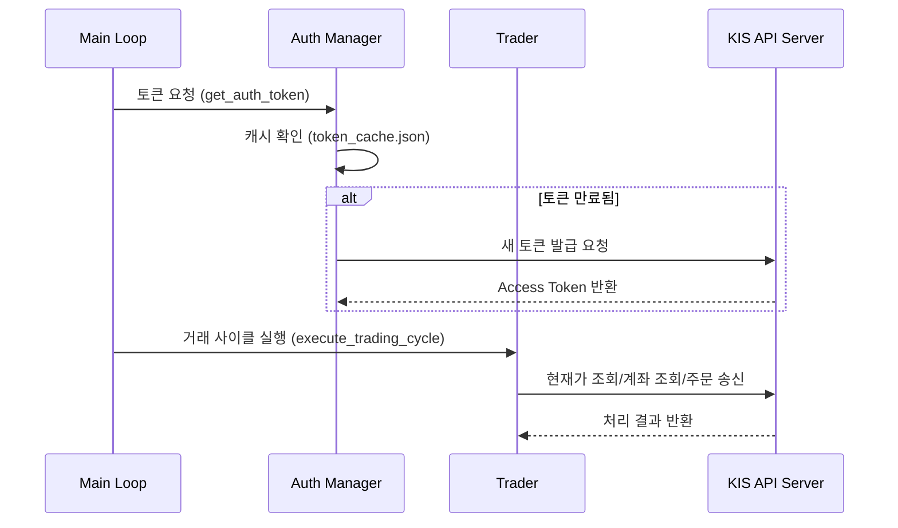

# 🚀 삼성전자 자동 매매 시스템 (Samsung Auto Trader)

한국투자증권 Open API를 활용하여 삼성전자(005930) 주식을 자동으로 매매하는 파이썬 기반 시스템입니다. 지정된 시간 동안 시장을 모니터링하며 설정된 전략에 따라 주문을 수행합니다.

## ✨ 주요 기능

- **자동 매매 루프**: 매일 09:10 ~ 15:30 (KST) 사이에 자동으로 주가 확인 및 주문 실행.
- **모의/실전 투자 지원**: `config.py` 설정 하나로 모의 투자와 실전 투자를 간편하게 전환.
- **스마트 토큰 관리**: API 토큰을 로컬에 캐싱하여 불필요한 인증 요청을 최소화하고 효율성 증대.
- **커스텀 거래 전략**: 현재가 기준 오프셋(예: -2000원 매수, +2000원 매도) 기반의 간단하고 명확한 로직.
- **상세 로깅**: 모든 API 통신과 거래 과정을 한국 시간(KST) 기준으로 파일 및 콘솔에 기록.
- **보안 최적화**: API 키 및 계좌 정보는 `.env` 파일 또는 GitHub Secrets를 통해 안전하게 관리.

## ⚙️ 시스템 아키텍처 및 구동 방식

본 프로젝트는 유지보수와 확장성을 고려하여 **관심사 분리(Separation of Concerns)** 원칙에 따라 모듈화되었습니다.

### 0. 시스템 흐름도 (Execution Sequence)



### 1. 프로그램 워크플로우 (Data Flow)
1.  **초기화**: `main.py` 실행 시 환경 변수(`GH_APPKEY` 등)를 로드하고 `Trader` 객체를 생성합니다.
2.  **스케줄링**: `pytz`를 이용해 한국 시간(KST)을 계산하고, 장 운영 시간(09:10~15:30)인지 매 순간 체크합니다.
3.  **인증 (Auth)**: `auth.py`가 토큰을 관리합니다. 매번 발급받지 않고 `token_cache.json`에 저장된 토큰의 유효 기간을 검사하여 재사용하는 **Caching 전략**을 사용합니다.
4.  **거래 사이클 (Trading Cycle)**:
    - **시세 분석**: `market_data.py`를 통해 삼성전자의 현재가(`stck_prpr`)를 수집합니다.
    - **상태 확인**: `account.py`를 통해 현재 예수금과 보유 수량을 확인하여 주문 가능 여부를 판단합니다.
    - **주문 실행**: `orders.py`에서 계산된 가격(현재가 ± Offset)으로 지정가 주문을 송신합니다.
5.  **예외 처리**: `api_client.py`는 네트워크 오류나 타임아웃 발생 시 자동으로 **Retry(최대 3회)**를 시도하여 시스템의 안정성을 보장합니다.

### 2. 주요 모듈별 역할
| 모듈명 | 역할 설명 | 핵심 기술 |
| :--- | :--- | :--- |
| `main.py` | 프로그램 엔트리 포인트 및 메인 루프 제어 | Timezone 제어, 무한 루프 스케줄링 |
| `config.py` | 모든 설정값(URL, TR ID, 전략 파라미터) 중앙 집중 관리 | 환경 설정 추상화 |
| `api_client.py` | 저수준 HTTP 통신 클라이언트 | `requests`, Retry 로직, 에러 핸들링 |
| `trader.py` | 상위 수준의 거래 비즈니스 로직 조율 (Orchestrator) | 매수/매도 시나리오 제어 |
| `auth.py` | OAuth2.0 인증 및 액세스 토큰 생명주기 관리 | JSON 기반 토큰 캐싱 |
| `logger.py` | 시스템 동작 및 에러 추적을 위한 KST 기반 로깅 | `logging`, `KSTFormatter` |

### 3. 거래 전략 (Trading Strategy)
현재 구현된 전략은 **Price-Offset 기반의 지정가 매매**입니다.
- **매수 조건**: 현재가보다 `BUY_OFFSET`(기본 2000원) 낮은 가격에 지정가 주문을 제출하여 하락 시 저가 매수를 노립니다.
- **매도 조건**: 현재 보유 중인 수량이 있을 경우, 현재가보다 `SELL_OFFSET`(기본 2000원) 높은 가격에 매도 주문을 제출하여 익절을 시도합니다.
- **리스크 관리**: `config.py`에서 `IS_VIRTUAL = True` 설정을 통해 실제 자산 투입 전 가상 계좌에서 로직을 충분히 검증할 수 있도록 설계되었습니다.

### 4. 통신 방식 선택 근거 (REST vs WebSocket)
- **REST API 채택**: 본 프로젝트는 '지정가 예약 매매' 전략을 사용하므로, 초단위 시세 변화에 즉각 대응하는 것보다 **주문 요청의 명확한 성공 여부 확인과 계좌 상태 동기화**가 더 중요하다고 판단하여 안정적인 REST 방식을 채택했습니다.
- **한계점 및 확장성**: 30초 폴링 간격으로 인한 시세 반영 지연(Time Lag)은 인지하고 있으며, 향후 스캘핑(Scalping) 등 초단타 전략으로 확장 시 웹소켓(WebSocket) 기반의 실시간 시세 수신 모듈로 업그레이드할 수 있도록 `market_data.py`를 추상화하였습니다.

---

## 💎 기술적 차별점 

1.  **Robustness (견고함)**: 단순 API 호출에 그치지 않고, `api_client`에 재시도 로직을 구현하여 일시적인 네트워크 불안정에도 시스템이 중단되지 않게 설계했습니다.
2.  **Efficiency (효율성)**: 한국투자증권 API의 토큰 발급 제한을 고려하여 토큰 캐싱 기능을 구현, 불필요한 인증 요청을 줄였습니다.
3.  **Accuracy (정확성)**: 서버 환경(AWS, GitHub 등)에 관계없이 항상 한국 표준시로 동작하도록 시간대 처리를 엄격히 관리했습니다.

---

## 🛠 기술 스택

- **Language**: Python 3.8+
- **Libraries**: `requests`, `python-dotenv`, `pytz`
- **API**: 한국투자증권 Open API

## 🚀 시작하기

### 1. 환경 설정

먼저 프로젝트에 필요한 라이브러리를 설치합니다:

```bash
pip install -r requirements.txt
```

### 2. 환경 변수 등록

시스템 실행을 위해 다음 3가지 환경 변수가 필요합니다:
- `GH_ACCOUNT`: 한국투자증권 종합계좌번호 (8~10자리)
- `GH_APPKEY`: API App Key
- `GH_APPSECRET`: API App Secret

**로컬 환경:** 루트 폴더에 `.env` 파일을 생성하고 내용을 입력하세요.
**GitHub Codespaces:** 저장소의 `Settings > Secrets and variables > Codespaces`에서 등록하세요.

### 3. 실행 방법

**시스템 점검 (테스트):**
실제 매매를 시작하기 전에 연결 상태를 확인합니다.
```bash
python test_trading.py
```

**메인 프로그램 실행:**
```bash
python main.py
```

## 📂 프로젝트 구조

- `main.py`: 프로그램의 진입점으로 전체 거래 루프 관리.
- `trader.py`: 거래 사이클(주가 확인 -> 계좌 확인 -> 주문) 조율.
- `config.py`: 거래 대상, 시간, API URL 등 모든 설정값 관리.
- `api_client.py`: API 요청 전송 및 재시도(Retry) 로직 담당.
- `auth.py`: API 인증 토큰 발급 및 캐싱 관리.
- `account.py` / `market_data.py`: 계좌 정보 및 주가 데이터 처리.
- `orders.py`: 매수/매도 주문 실행 및 상태 조회.
- `logger.py`: 시스템 로그 설정 (KST 시간대 적용).

## ⚠️ 주의 사항

- **투자 책임**: 본 프로그램은 참고용으로 제작되었습니다. 자동 매매로 인한 모든 투자 손실의 책임은 사용자 본인에게 있습니다.
- **모의 투자 우선**: 실전 투자로 전환하기 전, `config.py`의 `IS_VIRTUAL = True` 설정을 통해 모의 투자 환경에서 충분히 테스트하는 것을 권장합니다.
- **보안**: `.env` 파일이나 `token_cache.json`이 공개된 저장소에 업로드되지 않도록 주의하세요. (이미 `.gitignore`에 포함되어 있습니다.)